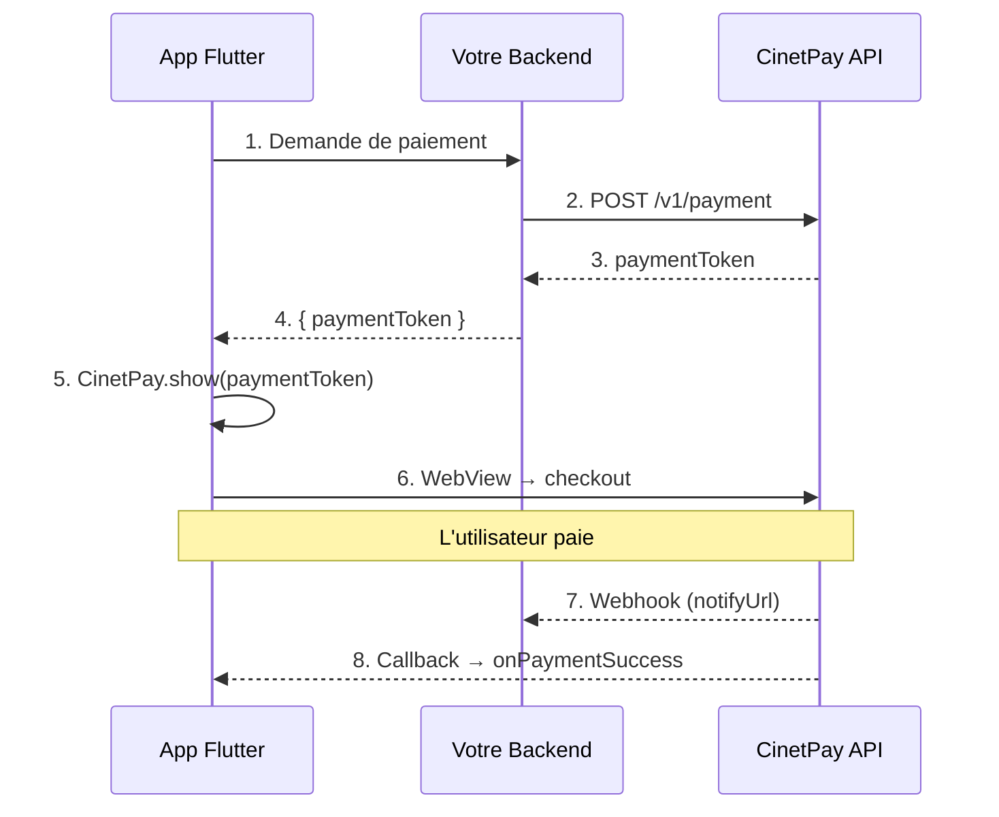

# CinetPay Flutter SDK

Flutter SDK for CinetPay payments. Opens the CinetPay checkout page in a WebView and reports the payment result back to your app.

This is a **frontend-only** SDK. The payment must be initialized on your backend first (using [cinetpay-js](https://github.com/cinetpay/cinetpay-js), [cinetpay-python](https://github.com/cinetpay/cinetpay-python), [cinetpay-go](https://github.com/cinetpay/cinetpay-go), or any backend), which returns a `paymentToken`. The Flutter SDK then opens `{checkoutHost}/checkout/{paymentToken}` in a WebView, where the host depends on the [environment](#2-open-the-checkout-in-your-flutter-app) the token was created on.

## Installation

Add the package to your `pubspec.yaml`:

```yaml
dependencies:
  cinetpay_flutter: ^1.0.0
```

Then run:

```bash
flutter pub get
```

### Configuration par plateforme

#### Android

Ajoutez la permission internet dans `android/app/src/main/AndroidManifest.xml` :

```xml
<manifest xmlns:android="http://schemas.android.com/apk/res/android">
    <uses-permission android:name="android.permission.INTERNET" />
    <!-- ... -->
</manifest>
```

Vérifiez que le `minSdkVersion` est au moins **19** dans `android/app/build.gradle` :

```groovy
android {
    defaultConfig {
        minSdkVersion 19
    }
}
```

#### iOS

Ajoutez les schémas d'URL dans `ios/Runner/Info.plist` pour le fallback navigateur (`url_launcher`) :

```xml
<key>LSApplicationQueriesSchemes</key>
<array>
    <string>https</string>
    <string>http</string>
</array>
```

Vérifiez que la version minimale est **12.0** dans `ios/Podfile` :

```ruby
platform :ios, '12.0'
```

## Usage

### 1. Initialize payment on your backend

Your backend calls the CinetPay API (`POST /v1/payment`) and returns a `paymentToken` to the mobile app. This step is **not** handled by this SDK.

```
App  -->  Your Backend  -->  CinetPay API
App  <--  paymentToken  <--  Your Backend
```

### 2. Open the checkout in your Flutter app

Import the SDK:

```dart
import 'package:cinetpay_flutter_sdk/cinetpay_flutter_sdk.dart';
```

> [!IMPORTANT]
> **Choisissez l'environnement.** Le `paymentToken` n'est valide que sur
> l'environnement qui l'a émis. Le SDK cible **la sandbox par défaut** : un token
> de production ouvert sans `environment: CinetPayEnvironment.production`
> produit un **404** sur la page de checkout.
>
> | Environnement | API backend | Hôte checkout |
> |---|---|---|
> | `CinetPayEnvironment.sandbox` (défaut) | `api.cinetpay.net` | `secure.cinetpay.net` |
> | `CinetPayEnvironment.production` | `api.cinetpay.co` | `secure.cinetpay.co` |

#### Method 1: Bottom sheet (recommended)

```dart
CinetPay.show(
  context: context,
  paymentToken: 'abc123def456...',
  environment: CinetPayEnvironment.production,
  onPaymentSuccess: (data) {
    print('Paid ${data.amount} ${data.currency}');
    print('Transaction ID: ${data.transactionId}');
  },
  onPaymentFailed: (data) {
    print('Payment refused');
  },
  onPaymentPending: (data) {
    print('Payment pending: ${data.status.value}');
  },
  onClose: () {
    print('Checkout closed');
  },
  onError: (error) {
    print('Error: ${error.code} - ${error.message}');
  },
);
```

#### Method 2: Full-screen page

```dart
Navigator.push(
  context,
  MaterialPageRoute(
    builder: (_) => CinetPayCheckoutPage(
      paymentToken: 'abc123def456...',
      onPaymentSuccess: (data) {
        Navigator.pop(context);
        // Handle success
      },
      onPaymentFailed: (data) {
        Navigator.pop(context);
        // Handle failure
      },
      onClose: () => Navigator.pop(context),
    ),
  ),
);
```

#### Method 3: Pre-styled button

```dart
CinetPayButton(
  paymentToken: 'abc123def456...',
  text: 'Payer 5000 XOF',
  onPaymentSuccess: (data) { ... },
  onPaymentFailed: (data) { ... },
)
```

With a custom icon:

```dart
CinetPayButton(
  paymentToken: token,
  text: 'Pay now',
  icon: Icon(Icons.payment),
  onPaymentSuccess: (data) { ... },
)
```

With custom styling:

```dart
CinetPayButton(
  paymentToken: token,
  text: 'Confirm Payment',
  style: ElevatedButton.styleFrom(
    backgroundColor: Colors.blue,
    foregroundColor: Colors.white,
    padding: EdgeInsets.symmetric(horizontal: 32, vertical: 16),
  ),
  onPaymentSuccess: (data) { ... },
)
```

#### Fallback: External browser

If WebView is not suitable, you can open the checkout in the system browser. Note that callbacks will NOT work in this mode; rely on your backend webhook instead.

```dart
await CinetPay.openInBrowser(
  paymentToken: 'abc123def456...',
  onError: (error) => print(error.message),
);
```

### Using CheckoutConfig

For reuse, you can create a `CheckoutConfig` object:

```dart
final config = CheckoutConfig(
  paymentToken: token,
  onPaymentSuccess: (data) { ... },
  onPaymentFailed: (data) { ... },
  onClose: () { ... },
);

// Use with show()
CinetPay.showFromConfig(context: context, config: config);

// Or with the button
CinetPayButton.fromConfig(config: config, text: 'Pay');

// Or with the full-screen page
CinetPayCheckoutPage.fromConfig(config: config);
```

### Vérification du statut (fortement recommandé)

La page de checkout ne renvoie pas systématiquement les détails du paiement à
l'application. Sans `statusChecker`, le SDK ne peut déduire que le **statut**
depuis l'URL : `amount`, `currency` et `transactionId` sont alors vides, et
`data.dataAvailable` vaut `false`.

Fournissez un `statusChecker` qui interroge **votre backend** (lequel appelle
`POST /v1/payment/check`) pour recevoir des réponses complètes et fiables :

```dart
CinetPay.show(
  context: context,
  paymentToken: token,
  environment: CinetPayEnvironment.production,
  statusChecker: () async {
    final res = await http.get(Uri.parse('$myBackend/payments/$token/status'));
    return jsonDecode(res.body) as Map<String, dynamic>;
  },
  statusPollInterval: const Duration(seconds: 3), // minimum 1s
  onPaymentSuccess: (data) {
    print('${data.amount} ${data.currency} — ${data.transactionId}');
  },
);
```

Le statut est interrogé tant que le checkout est ouvert, et le polling s'arrête
dès qu'un statut final est atteint. Le webhook `notify_url` de votre backend
reste la source de vérité pour créditer la commande.

## API Reference

### CinetPay

| Method | Description |
|--------|-------------|
| `CinetPay.show()` | Opens checkout as a bottom sheet |
| `CinetPay.showFromConfig()` | Opens checkout from a CheckoutConfig |
| `CinetPay.openInBrowser()` | Opens checkout in external browser (fallback) |

### Callbacks

| Callback | Type | Description |
|----------|------|-------------|
| `onPaymentSuccess` | `PaymentResponse` | Payment accepted |
| `onPaymentFailed` | `PaymentResponse` | Payment refused |
| `onPaymentPending` | `PaymentResponse` | Payment pending (PENDING, INITIATED, EXPIRED) |
| `onClose` | `void` | Checkout closed |
| `onError` | `PaymentError` | Technical error |

### PaymentResponse

| Field | Type | Description |
|-------|------|-------------|
| `amount` | `num` | Amount paid |
| `currency` | `String` | Currency code (XOF, XAF, etc.) |
| `status` | `PaymentStatus` | Payment status enum |
| `paymentMethod` | `String` | Method code (OM, MOMO, WAVE, VISA, etc.) |
| `description` | `String` | Payment description |
| `transactionId` | `String` | CinetPay transaction ID |
| `metadata` | `String?` | Custom metadata |
| `operatorId` | `String?` | Operator transaction ID |
| `paymentDate` | `String?` | Payment date |

### PaymentStatus

| Value | Description |
|-------|-------------|
| `PaymentStatus.accepted` | Payment confirmed |
| `PaymentStatus.refused` | Payment refused |
| `PaymentStatus.pending` | Pending confirmation |
| `PaymentStatus.initiated` | Initiated, not confirmed |
| `PaymentStatus.expired` | Payment expired |
| `PaymentStatus.unknown` | Unknown status |

Helper methods: `isSuccess`, `isFailed`, `isPending`.

### PaymentError

| Field | Type | Description |
|-------|------|-------------|
| `code` | `String` | Error code (INVALID_TOKEN, WEBVIEW_ERROR, etc.) |
| `message` | `String` | Human-readable message |

### Token Validation

Tokens are validated automatically. You can also validate manually:

```dart
if (TokenValidator.isValid(token)) {
  // Token format is correct
}

final error = TokenValidator.validate(token);
if (error != null) {
  print(error.message);
}
```

## Comment ça marche



1. Votre **backend** initialise le paiement via l'API CinetPay et obtient un `paymentToken`
2. L'app Flutter reçoit ce token et ouvre le checkout dans une **WebView** (mobile) ou le **navigateur** (web)
3. L'utilisateur paie — le SDK détecte le résultat via **postMessage** ou **interception d'URL**
4. Le callback approprié est appelé avec un `PaymentResponse`

## SDKs backend pour obtenir le paymentToken

Le `paymentToken` est obtenu côté serveur. Utilisez le SDK de votre choix :

| SDK | Langage | Installation |
|---|---|---|
| [`cinetpay-js`](https://github.com/cinetpay/cinetpay-js) | Node.js/TypeScript | `npm install cinetpay-js` |
| [`cinetpay-python`](https://github.com/cinetpay/cinetpay-python) | Python | `pip install cinetpay-python` |
| [`cinetpay-go`](https://github.com/cinetpay/cinetpay-go) | Go | `go get github.com/cinetpay/cinetpay-go` |
| [`cinetpay-laravel-sdk`](https://github.com/cinetpay/cinetpay-laravel-sdk) | PHP/Laravel | `composer require cinetpay/laravel-sdk` |
| API directe | Tout langage | `POST /v1/payment` |

### Exemple backend (Node.js)

```javascript
const { CinetPayClient } = require('cinetpay-js')

const client = new CinetPayClient({
  credentials: {
    CI: { apiKey: process.env.CINETPAY_API_KEY_CI, apiPassword: process.env.CINETPAY_API_PASSWORD_CI },
  },
})

app.post('/api/pay', async (req, res) => {
  const payment = await client.payment.initialize({
    currency: 'XOF',
    merchantTransactionId: `ORDER-${Date.now()}`,
    amount: req.body.amount,
    lang: 'fr',
    designation: 'Achat mobile',
    clientEmail: req.body.email,
    clientFirstName: req.body.firstName,
    clientLastName: req.body.lastName,
    successUrl: 'https://monsite.com/success',
    failedUrl: 'https://monsite.com/failed',
    notifyUrl: 'https://monsite.com/webhook',
    channel: 'PUSH',
  }, 'CI')

  res.json({ paymentToken: payment.paymentToken })
})
```

### Exemple Flutter complet (avec backend)

```dart
class PaymentService {
  static Future<String> getPaymentToken(int amount) async {
    final response = await http.post(
      Uri.parse('https://votre-api.com/api/pay'),
      headers: {'Content-Type': 'application/json'},
      body: jsonEncode({'amount': amount, 'email': 'client@email.com',
        'firstName': 'Jean', 'lastName': 'Dupont'}),
    );
    final data = jsonDecode(response.body);
    return data['paymentToken'];
  }
}

// Dans votre widget
ElevatedButton(
  onPressed: () async {
    final token = await PaymentService.getPaymentToken(5000);
    if (mounted) {
      CinetPay.show(
        context: context,
        paymentToken: token,
        onPaymentSuccess: (data) {
          ScaffoldMessenger.of(context).showSnackBar(
            SnackBar(content: Text('Payé ! ${data.amount} ${data.currency}')),
          );
        },
      );
    }
  },
  child: const Text('Payer 5000 XOF'),
)
```

## Pays supportés

| Pays | Code | Opérateurs |
|------|------|------------|
| Côte d'Ivoire | CI | Orange Money, Moov, MTN, Wave |
| Sénégal | SN | Orange Money, Free, Expresso, Wave |
| Cameroun | CM | Orange Money, MTN |
| Burkina Faso | BF | Orange Money, Moov, Wave |
| Mali | ML | Orange Money, Moov |
| Togo | TG | Moov, TMoney |
| Guinée | GN | Orange Money, MTN |
| Bénin | BJ | Moov, MTN |
| RD Congo | CD | Orange Money, Airtel, M-Pesa, Africell |
| Niger | NE | Airtel, Moov, Zamani |

## Sécurité

- Les credentials (`apiKey` / `apiPassword`) restent **côté serveur** — l'app ne reçoit qu'un `paymentToken` opaque
- Le `paymentToken` est validé (alphanumérique, 10-128 caractères) avant chargement
- La WebView n'autorise que les domaines CinetPay
- Les URLs externes sont ouvertes dans le navigateur système

## Plateformes supportées

| Plateforme | Comportement |
|---|---|
| **Android** | WebView intégrée (minSdkVersion 19) |
| **iOS** | WebView intégrée (iOS 12+) |
| **Web** | Ouvre le navigateur + écran d'attente |

## Requirements

- Flutter 3.10+
- Dart 3.0+

## Écosystème CinetPay

| Package | Cible |
|---|---|
| [`cinetpay-js`](https://npmjs.com/package/cinetpay-js) | Backend Node.js |
| [`cinetpay-python`](https://pypi.org/project/cinetpay-python/) | Backend Python |
| [`cinetpay-go`](https://github.com/cinetpay/cinetpay-go) | Backend Go |
| [`cinetpay-seamless`](https://npmjs.com/package/cinetpay-seamless) | Frontend web |
| **`cinetpay_flutter`** | **Mobile iOS/Android/Web** |
| [`cinetpay-mcp`](https://npmjs.com/package/cinetpay-mcp) | AI assistants |

## Support

Pour toute question sur l'API CinetPay : **support@cinetpay.com**

## Licence

MIT
